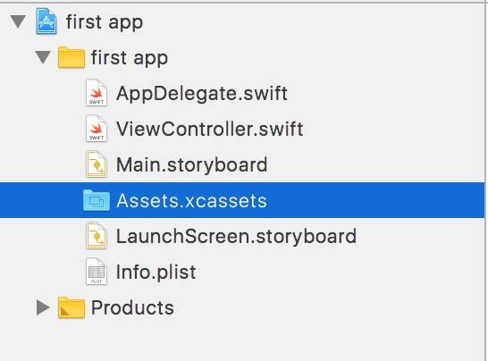

# FirstApp
Some basic iOS concepts. 

### 1 App Delegate:
It a class that listen to the system event; Or system calls some methods of that class if some events happends.
Events like (App Starts, App goes to background, App Terminates, Memory Warnings, ...). So that you can handle the situation like saving data or whatever.

### 2 Will/Did methods:
- `view`: is the screen.
- `Will`: means right before.
- `Did`: means right after.
- So `viewWillX` methods always are called before `viewDidX` methods.
- You can read `viewDidAppear` as "What should happens right after the view appear".
```swift
    /*
     * View: is the screen.
     * Did:  means right after.
     * Load: means loaded into memory.
     
     * General meaning: right after the view is loaded into memory.
     * It is called after the view is loaded into memeory.
    */
     override func viewDidLoad() {
     
        super.viewDidLoad()
        // Do any additional setup after loading the view, typically from a nib.
        print("viewDidLoad")   
    } // end viewDidLoad
```

### 3 Outlets and Actions
- `Actions`: sends commands from the view to the code.
    - record action;
- `Outlets`: used to send commands from the code to the view; use to control the view; Every view has an outlet so that you can controll it from the code.
    - disbling recording button.


### 4 Adding images
App images are added in `Assets.xcassets`



